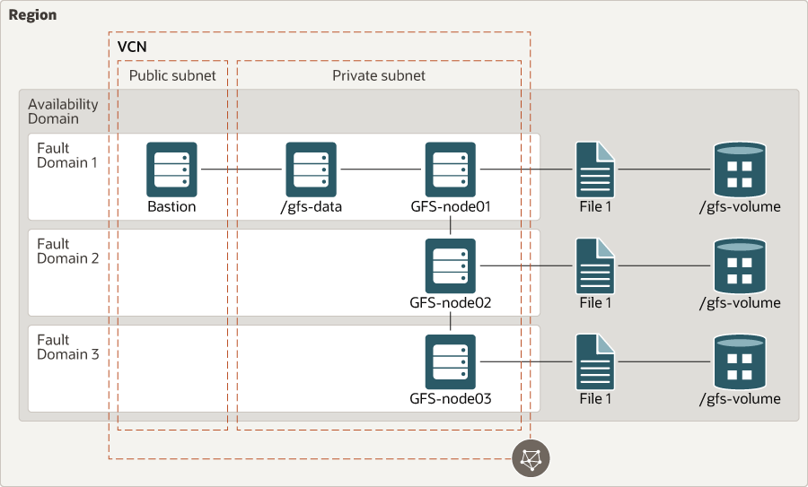

# terraform-oci-arch-gluster

## Reference Architecture

A scalable, distributed network file system is suitable for data-intensive tasks such as image processing and media streaming. When used in high-performance computing (HPC) environments, [GlusterFS](https://www.gluster.org/) delivers high-performance access to large data sets, especially immutable files.

This reference architecture contains the infrastructure components required for a distributed network file system. It contains three bare metal instances, which is the minimum required to set up high availability for [GlusterFS](https://www.gluster.org/) on [Oracle Cloud Infrastructure (OCI)](https://cloud.oracle.com/en_US/cloud-infrastructure).

For details of the architecture, see [_Deploy a scalable, distributed file system using GlusterFS_](https://docs.oracle.com/en/solutions/deploy-glusterfs/index.html)

## Architecture Diagram 


 
## Deploy Using Oracle Resource Manager

1. Click [](https://cloud.oracle.com/resourcemanager/stacks/create?region=home&zipUrl=https://github.com/oracle-devrel/terraform-oci-arch-gluster/releases/latest/download/terraform-oci-arch-gluster-stack-latest.zip)

    If you aren't already signed in, when prompted, enter the tenancy and user credentials.

2. Review and accept the terms and conditions.

3. Select the region where you want to deploy the stack.

4. Follow the on-screen prompts and instructions to create the stack.

5. After creating the stack, click **Terraform Actions**, and select **Plan**.

6. Wait for the job to be completed, and review the plan.

    To make any changes, return to the Stack Details page, click **Edit Stack**, and make the required changes. Then, run the **Plan** action again.

7. If no further changes are necessary, return to the Stack Details page, click **Terraform Actions**, and select **Apply**. 

## Deploy Using the Terraform CLI

### Clone the Module
Now, you'll want a local copy of this repo.  You can make that with the commands:

    git clone https://github.com/oracle-devrel/terraform-oci-arch-gluster.git
    cd terraform-oci-arch-gluster/
    ls

### Prerequisites
First off, you'll need to do some pre-deploy setup.  That's all detailed [here](https://github.com/cloud-partners/oci-prerequisites).

Secondly, create a `terraform.tfvars` file and populate with the following information:

```
# Authentication
tenancy_ocid         = "<tenancy_ocid>"
user_ocid            = "<user_ocid>"
fingerprint          = "<finger_print>"
private_key_path     = "<pem_private_key_path>"

# Region
region = "<oci_region>"

# Compartment
compartment_ocid = "<compartment_ocid>"

````    

## Update variables.tf file (optional)
This is optional, but you can update the variables.tf to change compute shapes, block volumes, etc. 

### Create the Resources
Run the following commands:

    terraform init
    terraform plan
    terraform apply

### Destroy the Deployment
When you no longer need the deployment, you can run this command to destroy the resources:

    terraform destroy

## Architecture Diagram


# Contributing
This project is open source.  Please submit your contributions by forking this repository and submitting a pull request!  Oracle appreciates any contributions that are made by the open source community.

## Attribution & Credits
Initially, this project was created and distributed in [GitHub Oracle QuickStart space](https://github.com/oracle-quickstart/oci-gluster). For that reason, we would like to thank all the involved contributors enlisted below:
- Taylor Newill (https://github.com/tanewill)
- Chuck Gilbert (https://github.com/gilbertc777)
- Pinkesh Valdria (https://github.com/pvaldria)
- Lukasz Feldman (https://github.com/lfeldman)
- mahajanarun (https://github.com/mahajanarun)
- Ben Lackey (https://github.com/benofben)

## License
Copyright (c) 2022 Oracle and/or its affiliates.

Licensed under the Universal Permissive License (UPL), Version 1.0.

See [LICENSE](LICENSE) for more details.

